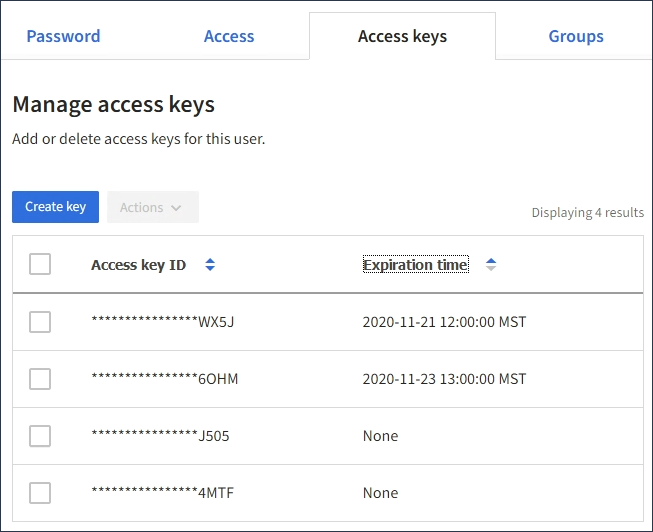

= 別のユーザのS3アクセスキーを表示しています
:allow-uri-read: 
:icons: font
:imagesdir: ../media/

[role="lead"]
S3 テナントを使用している場合は、適切な権限があれば、別のユーザの S3 アクセスキーを表示できます。有効期限でリストをソートすると、まもなく期限切れになるキーを確認できます。必要に応じて、新しいキーを作成したり、使用されなくなったキーを削除したりできます。

.必要なもの
* Tenant Managerにはサポートされているブラウザを使用してサインインする必要があります。
* Root Access 権限が必要です。

IMPORTANT: ユーザに属する S3 バケットとオブジェクトには、 Tenant Manager でそのユーザに対して表示されるアクセスキー ID とシークレットアクセスキーを使用してアクセスできます。このため、アクセスキーはパスワードと同じように保護する必要があります。定期的にアクセスキーをローテーションし、使用されていないキーはアカウントから削除します。また、他のユーザとはアクセスキーを共有しないでください。

.手順
. アクセス管理 * > * Users * を選択します。
+
[ ユーザー ] ページが表示され、既存のユーザーが一覧表示されます。

. S3 アクセスキーを表示するユーザを選択します。
+
ユーザーの詳細ページが表示されます。

. 「 * アクセスキー * 」を選択します。
+

. キーを * Expiration time * または * Access key ID * でソートします。
. 必要に応じて、新しいキーを作成し、使用しなくなったキーを手動で削除します。
+
既存のキーの有効期限が切れる前に新しいキーを作成した場合、ユーザはアカウントのオブジェクトに一時的にアクセスできなくなることなく、新しいキーの使用を開始できます。

+
期限切れのキーは自動的に削除されます。

.関連情報
link:creating-another-users-s3-access-keys.html["別のユーザのS3アクセスキーを作成しています"]

link:deleting-another-users-s3-access-keys.html["別のユーザのS3アクセスキーを削除しています"]
