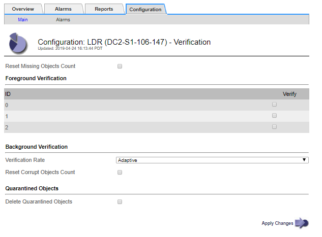

= オブジェクトの整合性を検証してい
:allow-uri-read: 
:icons: font
:imagesdir: ../media/

[role="lead"]
StorageGRID システムは、ストレージノード上のオブジェクトデータの整合性を検証し、オブジェクトの破損や欠落の有無を確認します。

検証プロセスには、バックグラウンド検証とフォアグラウンド検証の2つがあります。データの整合性を確保するために連携して機能します。バックグラウンド検証は、オブジェクトデータの正確性を継続的にチェックするために自動的に実行されます。フォアグラウンド検証は、オブジェクトの有無（正確性ではなく）をより迅速に確認するためにユーザによってトリガーされます。

== バックグラウンド検証とは

バックグラウンド検証プロセスは、ストレージノードにオブジェクトデータの破損したコピーがないかどうかを自動的かつ継続的にチェックし、問題が見つかった場合は自動的に修復を試みます。

バックグラウンド検証は、レプリケートオブジェクトとイレイジャーコーディングオブジェクトの整合性を次の方法でチェックします。

* * レプリケートオブジェクト * ：バックグラウンド検証プロセスで破損したレプリケートオブジェクトが検出された場合、破損したコピーはその場所から削除され、ストレージノード上の他の場所に隔離されます。その後、アクティブな ILM ポリシーに従って新しいコピーが生成され、配置されます。新しいコピーは、元のコピーに使用されていたストレージノードに配置されるとはかぎりません。

NOTE: 破損したオブジェクトデータは、引き続きアクセスできるように、システムから削除されるのではなく隔離されます。隔離されたオブジェクトデータへのアクセス方法については、テクニカルサポートにお問い合わせください。

* * イレイジャーコーディングオブジェクト * ：バックグラウンド検証プロセスでイレイジャーコーディングオブジェクトのフラグメントの破損が検出された場合、 StorageGRID は自動的に残りのデータとパリティフラグメントを使用して同じストレージノード上に欠落フラグメントの再構築を試みます。破損したフラグメントを再構築できなかった場合は、「Corrupt Copies Detected（ECOR）」属性の値が1つ増え、オブジェクトの別のコピーを読み出そうとします。読み出しに成功すると、 ILM 評価が実行されて、イレイジャーコーディングオブジェクトの置き換え用のコピーが作成されます。
+
バックグラウンド検証プロセスでは、ストレージノード上のオブジェクトのみチェックされます。アーカイブノード上またはクラウドストレージプール内のオブジェクトはチェックされません。バックグラウンド検証を実行するには、 4 日以上経過したオブジェクトが必要です。

バックグラウンド検証は、通常のシステムアクティビティを妨げないように設定された間隔で継続的に実行されます。バックグラウンド検証を停止することはできません。ただし、問題があると疑われる場合は、バックグラウンド検証の回数を増やして、ストレージノードの内容をより迅速に検証することができます。

=== バックグラウンド検証に関連するアラートとアラーム（レガシー）

破損したオブジェクトが自動的に修正できないことがシステムによって検出された場合（破損によってオブジェクトが特定されないため）、「識別されていない破損オブジェクトが検出されました * 」アラートがトリガーされます。

別のコピーが見つからないため、バックグラウンド検証が破損したオブジェクトを置き換えることができない場合は、* Objects lost *アラートとLOST（Lost Objects）レガシーアラームがトリガーされます。

== バックグラウンド検証レートを変更しています

データ整合性に関する懸念事項がある場合は、バックグラウンド検証によってストレージノード上のレプリケートオブジェクトデータをチェックする速度を変更できます。

.必要なもの
* Grid Managerにはサポートされているブラウザを使用してサインインする必要があります。
* 特定のアクセス権限が必要です。

.このタスクについて
ストレージノードに対するバックグラウンド検証の検証レートを変更できます。

* Adaptive ：デフォルト設定です。最大 4MB/ 秒または 10 オブジェクト / 秒（先に超過した方）で検証するようにタスクが設計されます。
* High ：ストレージ検証は高速で実行され、通常のシステムアクティビティの処理速度が低下する可能性があります。

この設定は、ハードウェアまたはソフトウェアの障害により、オブジェクトデータが破損している可能性がある場合にのみ使用します。優先度の高いバックグラウンド検証が完了すると、検証レートは自動的に適応にリセットされます。

.手順
. Support *>* Tools *>* Grid Topology *を選択します。
. [*_Storage Node]>[ldr]>[Verification*]を選択します。
. * Configuration * > * Main * を選択します。
. 「 * LDR * > * Verification * > * Configuration * > * Main * 」に移動します。
. バックグラウンド検証で、 * 検証レート * > * 高 * または * 検証レート * > * 適応 * を選択します。
+

NOTE: Verification Rate を High に設定すると、 Notice レベルで VPRI （ Verification Rate ）レガシーアラームがトリガーされます。

. [ 変更の適用 *] をクリックします。
. レプリケートオブジェクトのバックグラウンド検証の結果を監視します。
+
.. ノード*>*_ストレージノード_*>*オブジェクト*に移動します。
.. 「検証」セクションで、「破損したオブジェクト」および「破損したオブジェクトの特定なし」の値を監視します。
+
バックグラウンド検証で破損したレプリケートオブジェクトデータが見つかった場合は、「破損したオブジェクト * 」指標が増分され、 StorageGRID は次のようにデータからオブジェクト ID の抽出を試みます。

+
*** オブジェクト ID を抽出できる場合は、 StorageGRID によってオブジェクトデータの新しいコピーが自動的に作成されます。新しいコピーは、アクティブな ILM ポリシーを満たしていれば、 StorageGRID システム内のどこにでも作成できます。
*** オブジェクト ID を抽出できない場合（破損しているため）は、「 Corrupt Objects Unidentified * 」指標が増分され、「 Unidentified Corrupt Objects Detected * 」アラートがトリガーされます。

.. 破損したレプリケートオブジェクトデータが見つかった場合は、テクニカルサポートに連絡して破損のルート原因 を確認します。

. イレイジャーコーディングオブジェクトのバックグラウンド検証の結果を監視します。
+
バックグラウンド検証でイレイジャーコーディングオブジェクトデータの破損したフラグメントが検出された場合は、 Corrupt Fragments Detected 属性がその分だけ増分します。StorageGRID は、破損したフラグメントを同じストレージノード上に再構築して、この状況からリカバリします。

+
.. Support *>* Tools *>* Grid Topology *を選択します。
.. [*_Storage Node]>[ldr]>[Erasure Coding]を選択します。
.. Verification Results テーブルで、 Corrupt Fragments Detected （ ECCD ）属性を監視します。

. 破損したオブジェクトが StorageGRID システムによって自動的にリストアされたら、破損したオブジェクトの数をリセットします。
+
.. Support *>* Tools *>* Grid Topology *を選択します。
.. [*_Storage Node]>[ldr]>[Verification]>[Configuration*]を選択します。
.. 「破損オブジェクト数をリセット」を選択します。
.. [ 変更の適用 *] をクリックします。

. 隔離されたオブジェクトが不要であることが確実な場合は、オブジェクトを削除できます。

NOTE: Objects Lost * アラートまたは LOST （ Lost Objects ）レガシーアラームがトリガーされた場合、テクニカルサポートは、隔離されたオブジェクトにアクセスして、基になる問題 のデバッグやデータリカバリを試みることができます。

. Support *>* Tools *>* Grid Topology *を選択します。
. 「 * _ ストレージノード _ * > * LDR * > * Verification * > * Configuration * 」を選択します。
. ［ * 隔離オブジェクトの削除 * ］ を選択します。
. [ 変更の適用 *] をクリックします。

== フォアグラウンド検証とは

フォアグラウンド検証はユーザが開始するプロセスで、想定されるすべてのオブジェクトデータがストレージノード上に存在するかどうかをチェックします。フォアグラウンド検証は、ストレージデバイスの整合性を検証するために使用します。

フォアグラウンド検証は、ストレージノード上のオブジェクトデータの存在はチェックしても整合性はチェックしないため、バックグラウンド検証よりも実行時間が短くて済みます。フォアグラウンド検証で多くの項目が欠落していることが見つかった場合、ストレージノードに関連付けられているストレージデバイスのすべてまたは一部を含む問題 が存在する可能性があります。

フォアグラウンド検証は、レプリケートオブジェクトデータとイレイジャーコーディングオブジェクトデータの両方を次のようにチェックします。

* *レプリケートオブジェクト*：レプリケートされたオブジェクトデータのコピーが欠落していることがわかった場合、StorageGRID はシステム内の別の場所に格納されているコピーでコピーを自動的に置き換えます。ストレージノードは既存のコピーに対してILMを評価します。欠落したコピーはすでに想定される場所に存在しないため、このオブジェクトに関して現在のILMポリシーは満たされていないという結果となります。その結果、システムのアクティブなILMポリシーに沿って新しいコピーが生成されて配置されます。この新しいコピーは、欠落したコピーが格納されていた場所に配置されるとはかぎりません。
* *イレイジャーコーディングオブジェクト*：イレイジャーコーディングオブジェクトのフラグメントが欠落していることがわかった場合、StorageGRID は自動的に残りのフラグメントを使用して同じストレージノード上に欠落フラグメントの再構築を試みます。欠落フラグメントを再構築できなかった場合（失われたフラグメントの数が多すぎるため）は、「Corrupt Copies Detected（ECOR）」属性の値が1つ増えます。次にILMは、新しいイレイジャーコーディングコピーを生成するために使用できる、オブジェクトの別のコピーを探します。
+
フォアグラウンド検証でストレージボリューム上のイレイジャーコーディングを含む問題 が特定されると、フォアグラウンド検証タスクは一時停止し、影響を受けたボリュームを示すエラーメッセージが表示されます。該当するストレージボリュームに対してリカバリ手順 を実行する必要があります。

欠落しているレプリケートオブジェクトまたは破損したイレイジャーコーディングオブジェクトの他のコピーがグリッド内に見つからなかった場合は、* Objects Lost *アラートとLOST（Lost Objects）レガシーアラームがトリガーされます。

== フォアグラウンド検証を実行しています

フォアグラウンド検証では、ストレージノードにデータが存在するかどうかを確認できます。オブジェクトデータが欠落している場合、基盤となるストレージデバイスに問題 が存在している可能性があります。

.必要なもの
* 次のグリッドタスクが実行されていないことを確認します。
+
** Gridの拡張：ストレージノードを追加する際にサーバを追加（GEXP
** Storage Node Decommissioning（LDCM）。グリッドタスクが実行中の場合は、それらが完了するまで待つか、ロックを解除します。

* ストレージがオンラインであることを確認します（* Support *>* Tools *>* Grid Topology *を選択します。次に、「*_ストレージ・ノード_*>* LDR *>* Storage *>* Overview *>* Main *」を選択します。* Storage State-Current *がOnlineであることを確認します）。
* 次のリカバリ手順が同じストレージノード上で実行されていないことを確認します。
+
** 障害ストレージボリュームのリカバリ
** システムドライブのフォアグラウンド検証でエラーが発生したストレージノードをリカバリすると、リカバリ手順の実行中に役立つ情報が得られません。

.このタスクについて
フォアグラウンド検証は、欠落しているレプリケートオブジェクトデータとイレイジャーコーディングオブジェクトデータの両方をチェックします。

* フォアグラウンド検証で大量の欠落オブジェクトデータが見つかった場合は、調査および対処が必要なストレージノードのストレージを備えた問題 が存在する可能性があります。
* イレイジャーコーディングデータに関連する重大なストレージエラーがフォアグラウンド検証で見つかった場合は、通知が送信されます。ストレージボリュームのリカバリを実行してエラーを修復する必要があります。

フォアグラウンド検証では、ストレージノードのすべてのオブジェクトストアをチェックすることも、特定のオブジェクトストアのみをチェックすることもできます。

フォアグラウンド検証で欠落オブジェクトデータが見つかった場合、StorageGRID システムはデータの置き換えを試みます。置き換え用のコピーを作成できない場合、LOST（Lost Objects）アラームがトリガーされることがあります。

フォアグラウンド検証を実行すると、LDRフォアグラウンド検証グリッドタスクが生成されます。このタスクの所要時間はストレージノードに格納されているオブジェクトの数によって異なり、完了までに数日から数週間かかることがあります。同時に複数のストレージノードを選択できますが、これらのグリッドタスクが同時に実行されることはありません。代わりに、キューに登録され、1つずつ順番に実行されます。あるストレージノードでフォアグラウンド検証が実行中のときは、そのストレージノードで他のボリュームを検証するオプションを選択できたとしても、同じストレージノードで別のフォアグラウンド検証タスクを開始することはできません。

フォアグラウンド検証の実行中でないストレージノードがオフラインになった場合は、*% complete *属性が99.99%に達するまでグリッドタスクが続行されます。この場合、「*%complete」属性は50%にフォールバックされ、ストレージノードがオンラインステータスに戻るまで待機します。ストレージノードがオンライン状態に戻ると、LDRフォアグラウンド検証グリッドタスクが再開されて完了するまで実行されます。

.手順
. 「 * _ ストレージノード _ * > * LDR * > * Verification * 」を選択します。
. * Configuration * > * Main * を選択します。
. [* Foreground Verification]で、確認する各ストレージボリュームIDのチェックボックスを選択します。
+
image::../media/foreground_verification_volume_id_selection.gif[フォアグラウンド検証の設定ページ]

. [ 変更の適用 *] をクリックします。
+
ページが自動的に更新されてリロードされるまで待ってから、ページを終了します。ページが更新されると、そのストレージノードのオブジェクトストアは選択できなくなります。

+
LDRフォアグラウンド検証グリッドタスクが生成され、完了または一時停止するか、または中止されるまで実行されます。

. 欠落オブジェクトまたは欠落フラグメントを監視します。
+
.. 「 * _ ストレージノード _ * > * LDR * > * Verification * 」を選択します。
.. [Overview（概要）]タブの[* Verification Results（検証結果）*]の下にある[* Missing Objects Detected（不足オブジェクトが検出されました）]の値を
+
*注*：Nodesページで、「* Lost Objects *」と同じ値が報告されます。ノード*>*_ストレージノード_*に移動し、*オブジェクト*タブを選択します。

+
「Missing Objects Detected」の数が多い場合（欠落オブジェクトが数百ある場合）は、ストレージノードのストレージを含む問題 が存在する可能性があります。テクニカルサポートにお問い合わせください。

.. 「 * _ ストレージノード _ * > * LDR * > * イレイジャーコーディング * 」を選択します。
.. [Overview（概要）]タブの[* Verification Results]（検証結果）で、[*Missing Fragments Detected（欠落フラグメントが検出されました）*]の値を確認
+
「Missing Fragments Detected」の数が多い場合（欠落フラグメントが数百個ある場合）は、ストレージノードのストレージを含む問題 が存在する可能性があります。テクニカルサポートにお問い合わせください。

+
レプリケートオブジェクトコピーまたはフラグメントの欠落がフォアグラウンド検証で大量に見つからなければ、ストレージは正常に動作しています。

. フォアグラウンド検証グリッドタスクが完了するまで監視します。
+
.. Support *>* Tools *>* Grid Topology *を選択します。次に、* site *>*_Admin Node_*>* cmn *>* Grid Task *>* Overview *>* Main *の順に選択します。
.. フォアグラウンド検証グリッドタスクがエラーなく実行されていることを確認します。
+
*注：フォアグラウンド検証グリッドタスクが一時停止すると、グリッドタスクステータス（SCAS）に対してNoticeレベルのアラームがトリガーされます。

.. を使用してグリッドタスクが一時停止した場合 `critical storage error`をクリックし、影響を受けたボリュームをリカバリしてから、残りのボリュームでフォアグラウンド検証を実行してさらにエラーが発生していないかを確認します。
+
*注意*：フォアグラウンド検証グリッドタスクがメッセージとともに一時停止した場合 `Encountered a critical storage error in volume _volID_`では、障害ストレージボリュームをリカバリするために手順 を実行する必要があります。リカバリとメンテナンスの手順を参照してください。

.完了後
データの整合性についてまだ懸念がある場合は、「* LDR *>* Verification *>* Configuration *>* Main *」に移動し、バックグラウンド検証レートを増やしてください。バックグラウンド検証は、格納されているすべてのオブジェクトデータの正確性を確認し、見つかった問題を修復します。潜在的な問題をできるだけ早く検出して修復することで、データ損失のリスクが軽減されます。

.関連情報
link:../maintain/index.html[""]
