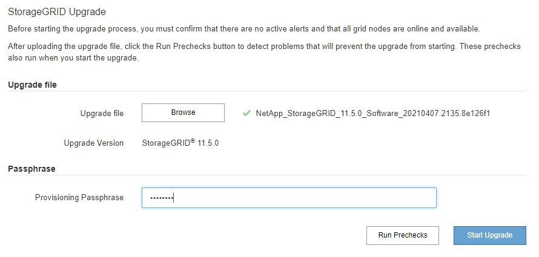
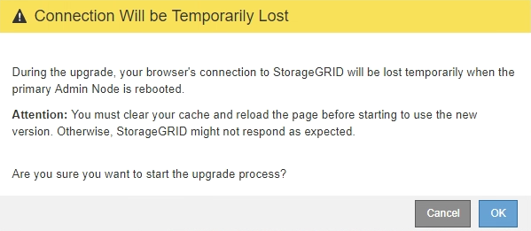
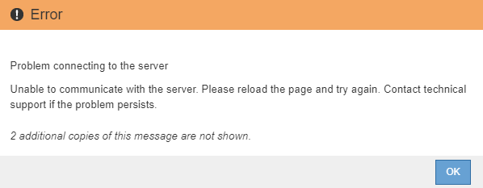

= アップグレードを開始する
:allow-uri-read: 
:icons: font
:imagesdir: ../media/

[role="lead"]
アップグレードを実行する準備ができたら、ダウンロードしたファイルを選択してプロビジョニングパスフレーズを入力します。オプションとして、実際のアップグレードを実行する前にアップグレードの事前確認を実行することもできます。

.必要なもの
のすべての考慮事項を確認し、のすべての手順を完了しておきます link:upgrade-planning-and-preparation.html["アップグレードの計画と準備"]。

.手順
. サポートされているブラウザを使用してGrid Managerにサインインします。
. [* Maintenance * （メンテナンス） ] > [* System * （ * システム * ） ] > [* Software Update * （ソフトウェア・アップデート
+
Software Update ページが表示されます。

. StorageGRID アップグレード * を選択します。
+
StorageGRID のアップグレードページが表示されます。このページには、アップグレードの実行後にプライマリ管理ノードがリブートされた場合や管理APIが再起動された場合を除き、最後に完了したアップグレードの日時が表示されます。

. を選択します `.upgrade` ダウンロードしたファイル。
+
.. [ * 参照 * ] を選択します。
.. 次のファイルを探して選択します。 `NetApp_StorageGRID_version_Software_uniqueID.upgrade`
.. 「 * 開く * 」を選択します。
+
ファイルがアップロードされて検証されます。検証プロセスが完了したら、アップグレードファイル名の横に緑のチェックマークが表示されます。

. プロビジョニングパスフレーズをテキストボックスに入力します。
+
Run PreChecks * ボタンと * Start Upgrade * ボタンが有効になります。

+

. 実際のアップグレードを開始する前にシステムの状態を検証する場合は、*事前チェックを実行*を選択します。その後、事前確認で報告されたエラーを解決します。
+

IMPORTANT: カスタムのファイアウォールポートが開いている場合は、事前確認の実行中に通知されます。アップグレードを続行する前に、テクニカルサポートに連絡する必要があります。

+

NOTE: アップグレードの開始*を選択した場合も、同じ事前確認が実行されます。[Run Prechecks] を選択すると、アップグレードを開始する前に問題を検出して解決できます。

. アップグレードを実行する準備ができたら、 * アップグレードを開始 * を選択します。
+
プライマリ管理ノードのリブート時にブラウザの接続が失われることを通知する警告が表示されます。プライマリ管理ノードが再び使用できるようになったら、WebブラウザのキャッシュをクリアしてSoftware Upgradeページをリロードする必要があります。

+

. 警告を確認してアップグレードプロセスを開始するには、「 * OK 」を選択します。
+
アップグレードを開始すると、次の処理が

+
.. アップグレードの事前確認が実行されます。
+

NOTE: 事前確認のエラーが報告された場合は、それらを解決し、 * アップグレードの開始 * を再度選択します。

.. プライマリ管理ノードがアップグレードされます。これには、サービスの停止、ソフトウェアのアップグレード、サービスの再開が含まれます。プライマリ管理ノードのアップグレード中はGrid Managerにアクセスできません。監査ログも使用できなくなります。このアップグレードには最大 30 分かかることがあります。
+

NOTE: プライマリ管理ノードのアップグレード中に、次のエラーメッセージが繰り返し表示されますが、このエラーは無視してかまいません。

+

+
image::../media/software_upgrade_503_error.png[ソフトウェアアップグレード 503 エラー]

+
image::../media/software_upgrade_400_error.png[ソフトウェアアップグレード 400 エラー]

. プライマリ管理ノードのアップグレードが完了したら、Webブラウザのキャッシュをクリアし、再度サインインして、ソフトウェアのアップグレードページをリロードします。
+
手順については、 Web ブラウザのドキュメントを参照してください。

+

IMPORTANT: Web ブラウザのキャッシュをクリアするのは、前のバージョンのソフトウェアで使用していた古いリソースを削除するためです。

.関連情報
link:upgrade-planning-and-preparation.html["アップグレードの計画と準備"]
