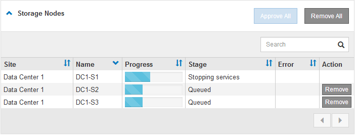

= グリッドノードのアップグレードとアップグレードの完了
:allow-uri-read: 
:icons: font
:imagesdir: ../media/

[role="lead"]
プライマリ管理ノードをアップグレードしたあと、StorageGRID システムに含まれる他のグリッドノードをすべてアップグレードする必要があります。個 々 のグリッドノード、グリッドノードのグループ、またはすべてのグリッドノードを選択して、アップグレードの順序をカスタマイズできます。

.手順
. Software UpgradeページのUpgrade Progressセクションを確認します。このセクションには、各メジャーアップグレードタスクに関する情報が記載されています。
+
.. * アップグレード・サービスの開始 * が最初のアップグレード・タスクですこのタスクでは、ソフトウェアファイルがグリッドノードに配信され、アップグレードサービスが開始されます。
.. * Start Upgrade Service * タスクが完了すると、 * Upgrade Grid Nodes * タスクが開始されます。
.. * Upgrade Grid Nodes * タスクの実行中は、 Grid Node Status テーブルが表示され、システム内の各グリッドノードのアップグレードステージが示されます。

. グリッドノードがグリッドノードステータステーブルに表示されたあと、グリッドノードを承認する前に、リカバリパッケージの新しいコピーをダウンロードします。
+

IMPORTANT: プライマリ管理ノードでソフトウェアバージョンをアップグレードしたあとで、リカバリパッケージファイルの新しいコピーをダウンロードする必要があります。リカバリパッケージファイルは、障害が発生した場合にシステムをリストアするために使用します。

. Grid Node Status テーブルの情報を確認します。グリッドノードは、管理ノード、 API ゲートウェイノード、ストレージノード、およびアーカイブノードの各セクションに分類されています。
+
image::../media/software_upgrade_start_grid_node_status.gif[管理ノードの完了後の Grid ノードのアップグレードのスクリーンショット]

+
このページが最初に表示されたとき、グリッドノードは次のいずれかの段階にあります。

+
** Done （プライマリ管理ノードのみ）
** アップグレードを準備中
** ソフトウェアのダウンロードがキューに登録され
** ダウンロード中です
** 承認待ちです

. アップグレードキューに追加する準備ができたグリッドノードを承認します。同じタイプの承認済みノードが一度に 1 つずつアップグレードされます。
+
ノードのアップグレード順序が重要な場合は、ノードまたはノードグループを 1 つずつ承認し、各ノードでアップグレードが完了するまで待ってから、次のノードまたはノードグループを承認します。

+

IMPORTANT: グリッドノードでアップグレードを開始すると、そのノードのサービスは停止します。グリッドノードはあとでリブートされます。このような処理を実行すると、ノードと通信しているクライアントで原因 サービスが中断する可能性があります。ノードを停止およびリブートして問題ないことを確認するまでは、そのノードのアップグレードを承認しないでください。

+
** 1 つまたは複数の * 承認 * ボタンを選択して、アップグレードキューに 1 つまたは複数のノードを追加します。
** 各セクション内の * すべて承認 * ボタンを選択して、同じタイプのすべてのノードをアップグレードキューに追加します。
** グリッド内のすべてのノードをアップグレードキューに追加するには、最上位の * すべて承認 * ボタンを選択します。

. アップグレードキューからノードまたはすべてのノードを削除する必要がある場合は、「* Remove *」または「* Remove All *」を選択します。
+
例に示すように、Stageが* Stopping services *に達すると、* Remove *ボタンが非表示になり、ノードを削除できなくなります。

+

. 各ノードのアップグレード段階の処理が終わるまで待機します。各段階には、Queued、Stopping services、Stopping container、Cleaning up Docker images、Upgrading base OS packages、Rebaling、and Starting servicesがあります。
+

NOTE: アプライアンスノードの Upgrading base OS packages ステージに達すると、アプライアンス上の StorageGRID アプライアンスインストーラソフトウェアが更新されます。この自動プロセスにより、 StorageGRID アプライアンスインストーラのバージョンが StorageGRID ソフトウェアのバージョンと常に同期された状態になります。

+
すべてのグリッドノードをアップグレードすると、「Upgrade Grid Nodes *」タスクが完了と表示されます。残りのアップグレードタスクは自動的にバックグラウンドで実行されます。

. 機能の有効化*タスクが完了すると（すぐに実行されます）、アップグレードされたStorageGRID バージョンの新機能の使用を開始できます。
+
たとえば、StorageGRID 11.5にアップグレードするときに、S3オブジェクトロックを有効にするか、キー管理サーバを設定するか、Metadata Reserved Space設定を拡張できます。

+
link:increasing-metadata-reserved-space-setting.html["Metadata Reserved Space設定を拡張しています"]

. *データベースのアップグレード*タスクの進捗状況を定期的に監視します。
+
このタスクの実行中、各ストレージノード上のCassandraデータベースがアップグレードされます。

+

NOTE: データベースのアップグレード*タスクが完了するまでに数日かかることがあります。このバックグラウンドタスクの実行時に、ホットフィックスの適用やノードのリカバリが可能です。ただし、最終アップグレード手順*タスクが完了するまで待ってから、拡張または手順 の運用停止を実行する必要があります。

+
このグラフを確認して、各ストレージノードの進捗状況を監視できます。

+
image::../media/software_upgrade_upgrade_database.png[ソフトウェアアップグレードデータベース]

. データベースのアップグレード * タスクが完了したら、 * 最終アップグレード手順 * タスクが完了するまで数分待ちます。
+
image::../media/software_upgrade_final_upgrade_steps.png[最終アップグレード手順]

+
最終アップグレード手順タスクが完了すると、アップグレードが完了します。

. アップグレードが正常に完了したことを確認します。
+
.. サポートされているブラウザを使用してGrid Managerにサインインします。
.. 「*ヘルプ*>*バージョン情報*」を選択します。
.. 表示されたバージョンが想定どおりであることを確認します。
.. [* Maintenance * （メンテナンス） ] > [* System * （ * システム * ） ] > [* Software Update * （ソフトウェア・アップデート次に、* StorageGRID アップグレード*を選択します。
.. 緑のバナーが表示されていて、ソフトウェアのアップグレードが予定の日時に完了していることを確認します。
+
image::../media/software_upgrade_done.png[ソフトウェアアップグレードが完了しました]

. グリッドの動作が正常に戻っていることを確認します。
+
.. サービスが正常に動作していること、および予期しないアラートが発生していないことを確認してください。
.. StorageGRID システムへのクライアント接続が想定どおり動作していることを確認する。

. ネットアップのダウンロードページでStorageGRID を確認し、インストールしたStorageGRID バージョンに対応したホットフィックスがないかどうかを確認します。
+
https://["ネットアップのダウンロード： StorageGRID"^]

+
StorageGRID 11.5._x.y_version の番号で、次の手順を実行します。

+
** メジャーリリースの_x_valueは0（11.5.0）です。
** マイナーリリースがある場合、0以外の値（11.5.1など）が_x_valueになっています。
** ホットフィックスがある場合は、_y_value（例：11.5.0.1）です。

. 該当する場合は、最新のホットフィックスをダウンロードしてStorageGRID バージョンに適用します。
+
ホットフィックスの適用については、リカバリとメンテナンスの手順を参照してください。

.関連情報
link:downloading-recovery-package.html["リカバリパッケージをダウンロードしています"]

link:../maintain/index.html[""]
